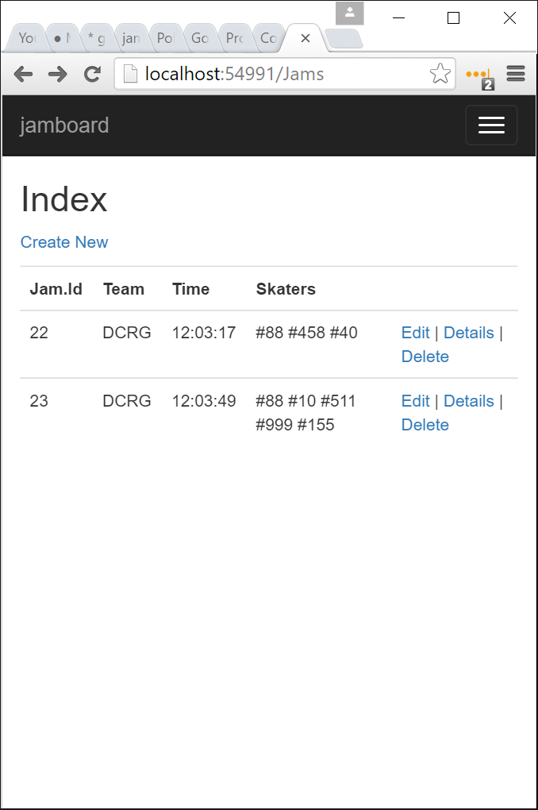

# jamboard:
## Realtime Roller Derby Line-Up Tracking 
a class project for [&lt;Code Louisville&gt;](http://www.codelouisville.org/)

## Introducing Roller Derby

Like Basketball, Roller derby is team sport with two teams of five players each. Unlike most team games, both teams are simultaneously playing offense and defense. The game is played on an oval track. Player are referred to as 'skaters'. One special skater for each team is the 'jammer', and she scores points by lapping members of the opposing team. Various rules conspire to keep non-jammer skaters - called 'blockers' - from moving as fast as the jammers, so the game becomes a full-contact sport rather than a speed skating race. 

Games are subdivided into 'jams', similar to 'plays' in football. Typically, each skater substitutes out at the end of every jam.  Simply recording who is in play is a full-time job for two different officials - one keeps track of each team's fielded skaters. 

## Introducing jamboard

Jamboard is proof-of-concept for a web-and-tablet-based, multi-headed, real time skater tracking system. Unlike most projects, it's intended to run on an intranet, with a database with less than 1000 rows total. 


## Workflow

Prior to a game, both teams submit rosters of players. Teams and players are entered into the DB by officials. Note that running the db-initalizing migration will seed the db with two teams and dozens of players. In a real game, these tables would have to be dropped before real data entry.

Prior to every jam, an official for each team records that team's fielded skaters.

## Data Model

There are **Teams, Skaters, Jams** and **SkaterJam** tables. All but the last have corresponding Models, Views, and Controllers.  

Building the data model from C# using Code First and Entity Framework 6 consisted of the bulk of my time spent on this project. THe rest of this section details the relationships betweeen these models. 

#### Many-to-One Relationships

Teams have many skaters. Skaters belong to exactly one team. 


Jams belong to exactly one team. Teams have many jams. In "the real world", a jam doesn't belong to one team or the other. But I tagged a "jam" object with a team to allow each tablet-weilding official to do simultaneous data-entry, and have some blindingly obvious way of telling each other's work apart. 



These relationships were specified in C# model files, were detected by Entity Framework, and are compiled into the database schema by a 'code first migration' included in this repository. 

Controller and View scaffolding was generated and tweaked to allow the user to edit teams, skaters, and jams. Nearly full CRUD is supported. See 'Pictures of CRUD' below

#### Many-to-Many Relationship

Skaters participate in many jams. Jams have five skaters, though internally it's of course any number. This is a textbook many-to-many relationship. 

This relationship was specified in C# model files, was detected by Entity Framework, and is compiled into the database schema by a 'code first migration' included in this repository. This includes the SkaterJams join table. 

Since SkaterJams is an implementation detail, and not a UI concept we want to put in the user's face, I didn't generate a controller or views for SkaterJams. Instead, the SkaterJam rows are manipulated implicitly through the CRUD of Jams:


In the screnshot above, note the eight underlying SkateJams in the database:


#### CRUD Warts

###### The Cascading Delete Cycle Issue

I made the decision to not support deletion of teams from the web interface. The way I understand it is this: leaving it in was causing a cascading delete cycle: Deleting a team deletes all it's skaters (reasonable), and deletes all it's jams (also reasonable). Deleting either a skater or a jam should delete any associated skaterJams (also, also reasonable). But having a skaterJam deletable from two different directions causes SQL to refuse to play ball with the whole sequence of cascading deletes.

To break the cycle, I tried to move the automatic deletions from SQL Server into the C# code's deletion method. I disabled cascading deletes for teams to jams and skaters, and did it in code. I was getting all kinds of complaints about trashing lists as I was iterating through them, null pointer exceptions, and whatnot. In the interest of time I decided to fall back to removing deletion of teams from the web interface. So Teams don't have full web CRUD. They just have 'CRU'. 

###### Jams
SkateJams are created implicitly via the web interface for creating Jams. I barely had time to make this interface work. It uses a ugly multiple-select list box. The original plan was to have a pretty grid of buttons representing players, but I ran out of time. I also didn't have time to support update of Jams, which isn't terrible - they can be 'updated' through delete-then-create.


###### Lack of Polished CRUD
In general the views are not polished or pretty. They're proof-of-concept that the database works. Since massaging CSS is grunt work for me at this point, but learning a new MVC framework is uncertain and difficult, I prioritized the scary and hard thing. Thus stuff I'm actually good at remains undone. You can see plenty of examples of this polish in my other student project, [ContraDB](contradb.com)

## Technical Proficiency

#### ViewBags and ViewModels

To send paramaters from controllers to views, I mostly used ViewBag properties with dynamic casts. This is faster but less C-sharpie. 

By the end of the project I got more sophisticated and used a ViewModel, specifically the JamViewModel, which has a property going from the controller to the view (AllSkaters), and a property going from the view back to the controller (SelectedSkaterIds). I had trouble finding good documentation on ViewModels. 

#### Lambdas and Closures

I love them! E.g. jamboard/Controllers/JamsController.cs:57
```
    db.Skaters.Where(sk8r => jamvm.SelectedSkaterIds.Contains(sk8r.Id))
```
includes a lambda that creates a closure over the free variable `jamvm`. 

## Features Left Unimplemented

#### Penalty Logging with SignalR and AngularJS

The original plan was to also track penalties, with yet another user using yet another tablet. They'd get realtime updates of the in-play skaters through `SignalR`, with a UI updated using `AngularJS`. However, the nuts and bolts of creating models with the proper relationships in ASP.NET MVC proved more time-consuming than I'd imagined, and I had to cut both from the project due to time. 

I did install a SignalR hub to the project, and got it working passing simple text messages, however, it's not in any way integrated to the rest of the project. Specifically, it doesn't update the penalty tracker's menu of skaters who can be penalized. 

#### Permissions

Security was always intended to be 'light' for this project. Because the destination installation was a LAN server physically at the derby game, and the people with login credentials are trusted officials for a derby bout, I didn't worry too much about skaters having names like `); DROP TABLE`, and I didn't worry about one user deleting another's data without their permission. 

I did allow Visual Studio to install the default authentication templates, and I tested that they worked. I just didn't go around decorating methods to require logged in users. That seems straightforward, but I simply didn't have time.

## Dark areas left unexercised

#### Deployment

It doesn't make sense to deploy it on the internet. It's designed to run from a LAN. 

#### Automated testing

Though I believe in Test Driven Devevlopment (TDD) in general, I feel that introducing it too early is a counter productive distraction. Learning is a hard process, and at first absolutely nothing is possible. At first, requirements should be brought as low as possible, in order to make _something_ achievable. But testing frameworks introduce their own requirements, and those are necessarily higher than "No Testing Development". Therefore automated testing should come in during the second quarter of learning, and TDD maybe in the third quarter. This is the first quarter, and therefore it's _too soon_. That's my firm opinion after learning two web frameworks in the last year. 

So I barely even glanced at testing. 

#### 'Data-first' development

Instead I did 'Code-first` because I think that's the way the wind is blowing. 

#### Fluent API

Again, I squeaked by with data annotations instead. I feel like that's the way the wind is blowing. 

#### JavaScript 

My last back end project was 33% JavaScript. This time the pendulum swung the other way, and other than some unobtrusive javascript and some unfinished scripting with SignalR, the project didn't use it at all. 

#### Responsive design

As mentioned above, I didn't do design work period. I mostly threw `div`s and `li`s at the bootstrap template. Once or twice I added a `form-control` or `col-md-10` class. But mostly I ignored aesthetics and I certainly didn't test on anything but one browser and one screen resolution. 

#### User Experience

The overall workflow of the site, and it's function, was not something I had time to make intuitive. The priority was getting the database updating, the ORM mapping, the rows squabbling. Anyone but me entering this site is going to be lost, and even **I** would rather use a pencil and paper to track skaters than this software. 

It's a proof of concept not a finished product. 

## Future

I've learned the jamboard approach will work to solve this problem. 

I've also learned that with my current skill set and my life obligations, I won't have time to make this into a legitimately useful OSS project in 2016. This makes me sad, but I am proud to have brought the project to some form of completion. 

## How to Install the Development Environment

I believe the installation procedure is to check out the project through Visual Stuidio / Github, then maybe edit the cocnnection string in Web.config, create a new database named `jamboard`, then from the Tools > NuGet Package Manager > Package Manager Console execute the command `Update-Database`. You may also need to get some other dependent packages, such as Entity-Framework, SignalR, AngularJS, and so on, but hopefully those error messages should be straightforward. Once that's sorted out, click the 'build project' button and browse away. 
